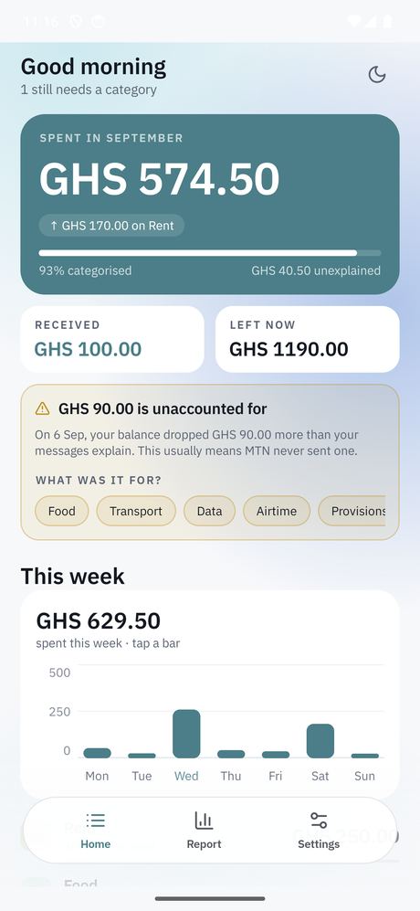
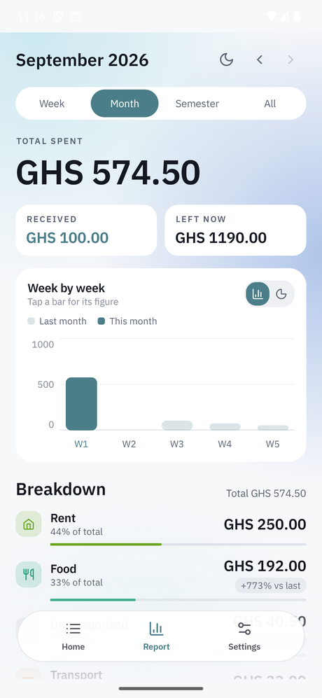
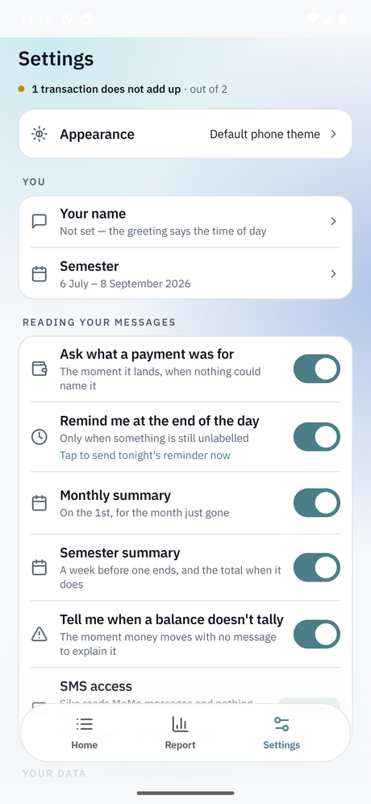
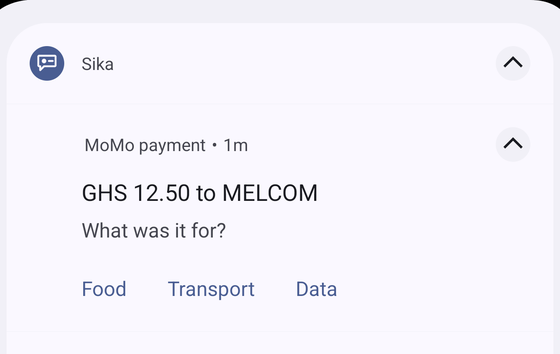
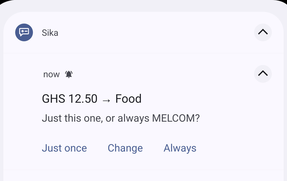

# Sika

An Android app that reads MTN MoMo SMS alerts and turns them into a spending ledger on the phone.

Money in, money out, where it went, and a report at the end of the month.

**Offline. No account, no server, no internet permission.** One user, one phone, MTN only.

## Try it

Sika is not on the Play Store and will not be. Google's policy on the SMS permission is written
for messaging apps and default dialers; a budgeting app that reads texts does not qualify for the
exception, whatever it does with them. So it is sideloaded.

Pick whichever line describes you.

### "I'm on MTN MoMo and I want to use it"

This is the real thing, and it is the only route that shows the app doing what it is for.

1. Download `app-release.apk` from [the latest release](https://github.com/Mutalib713/sika/releases/latest).
2. Open the file. Android will ask whether to allow installs from wherever you downloaded it —
   that switch is per-app and you can turn it back off afterwards.
3. Play Protect will warn you that the developer is unknown. That is accurate: this is signed
   with a personal key, not a Play account. Install anyway if you trust where you got it.
4. Open it, grant SMS access, and **wait a few seconds.** It reads your existing MoMo messages
   on first launch, so months of history appear immediately rather than starting from empty.

Needs **Android 12 or newer**.

### "I want to read the code"

```bash
git clone https://github.com/Mutalib713/sika.git
cd sika
```

Open the folder in Android Studio and let it sync, or build from the command line:

```bash
./gradlew assembleDebug
```

The APK lands in `app/build/outputs/apk/debug/`. `./gradlew installDebug` builds and pushes it to
a connected phone in one step.

You will need `local.properties` pointing at your Android SDK. It is gitignored, so create it:

```bash
echo 'sdk.dir=/your/path/to/Android/Sdk' > local.properties
```

⚠ On Windows, write the path with **forward slashes and an escaped colon** — `C\:/Users/you/AppData/Local/Android/Sdk`. A lone backslash is an escape character in a `.properties`
file, so `C:\Users` silently becomes an invalid path and Gradle reports "SDK location not found".

### "I'm not on MTN, or I just want to see it"

Then install nothing. **Sika will be an empty screen for you**, and that is not a bug — it has no
data of its own and no demo content in the release build. Vodafone Cash and AirtelTigo Money are
not parsed either.

Look at the [screenshots](#screenshots) instead. They are the whole app.

### Demo mode

There is a demo mode, and it is honest about what it is: fabricated rows held **in memory only**,
read *instead of* the ledger, never written to the database. Earlier versions injected fake
transactions through the real pipeline to see a screen populated, and every one became a genuine
row that had to be hunted down. One of them tripped reconciliation, correctly, because its
balances were invented. Fake money in a ledger whose entire argument is that its arithmetic checks
out is not acceptable, even briefly.

⚠ **It needs a debug build and a computer.** The receiver that turns it on is stripped from
release builds entirely, along with its class, so this is a developer tool and not something a
tester can reach from the phone.

```bash
./gradlew installDebug
adb shell "am broadcast -a gh.mutalib.sika.DEBUG_INJECT_SMS \
  -n gh.mutalib.sika/.sms.DebugSmsReceiver --es demo on"
```

`--es demo off` puts it back. Nothing persists either way: the rows die with the process.

## Screenshots

Captured on an emulator with fabricated data, so no real counterparty or balance appears in any
of them.

### The ledger

| | | |
|---|---|---|
|  |  |  |
| **Home.** What you spent, what is left, and how much of it is still unnamed. The amber card is reconciliation: GHS 90.00 left the account that no message explains, and rather than absorb it the app says so and asks what it was. | **Report.** Week, month, semester or all of it, with last month behind this month on the same axis. The breakdown is where the categories earn their keep. | **Settings.** Every notification is a switch, and SMS access says plainly what is being read. |

### Being asked what a payment was for

This is the part worth looking at, because it is the whole argument for the app. MoMo tells you
who got the money. Only you know what it was for, and only for about a day.

| | |
|---|---|
|  |  |
| A payment lands that no rule and no keyword could name, so it asks, in the shade, without opening the app. | Tapping a category only proposes it. **Always** teaches the shop so it never asks again; **Just once** answers this transaction alone. |

A cash-out gets different wording and never offers *Always*, because its counterparty is the agent
who handed over the notes rather than whatever you spent them on.

[docs/screenshots/README.md](docs/screenshots/README.md) has the capture recipe.

## What you are agreeing to when you install it

Worth reading, because the permission Sika asks for is a serious one and you should not take an
app's word for what it does with it.

**It asks to read your SMS.** Android grants that as all-or-nothing: the permission covers every
message on the phone, not the ones from MoMo. Sika filters to MTN's sender in the database query
itself, so nothing else is ever loaded, but that is a promise the app keeps and not one Android
enforces, and you are entitled to be suspicious of it.

**What Android *does* enforce:** there is no `INTERNET` permission in the manifest. Not omitted by
oversight, and not a setting. The line is absent, so the operating system refuses the app a
network socket. No library, no future version and no mistake can send a transaction anywhere,
because there is nothing to send it over. Check it yourself rather than believing this paragraph:

```bash
grep uses-permission app/src/main/AndroidManifest.xml
```

Four lines come back. `READ_SMS` and `RECEIVE_SMS` to read the messages, `POST_NOTIFICATIONS` to
ask you what a payment was for, and `RECEIVE_BOOT_COMPLETED` so the nightly reminder survives a
restart. That is the entire list.

Automatic cloud backup and device transfer are both switched off too, so Android does not copy
the ledger to Google Drive on your behalf.

**Your data goes nowhere and there is no account.** The consequence you should plan for: if you
lose the phone, you lose your categories. The transactions rebuild themselves from the SMS inbox
on a new phone, because that is where they came from. But the labels you set are yours alone, and
only a backup file saves them. Settings → Export.

## How it works

MoMo already texts you after every transaction. Android files every text into a shared store and
rings a bell the whole phone can hear. Sika leaves a note asking to be woken by that bell, reads
the message, pulls out the amount, fee, counterparty and balance, and writes one row.

It also sweeps the inbox on launch, so anything the bell missed still lands, and so your whole
existing history appears the day you install it.

Every message carries your balance afterwards, which means the ledger can check its own arithmetic
and tell you when it does not add up, instead of quietly showing a wrong total.

## What it does

**Keeps the ledger.** Eight message shapes parsed, deduped on MTN's transaction ID, with the raw
text stored beside every row so a parser fix can reprocess history rather than lose it.

**Checks its own arithmetic.** Every row is tested against the balance MTN printed on the message
before it. When money has moved that no message explains, Sika says so instead of absorbing it,
and you can say what it was and file it under a category. Anything counted that way is marked
*"with no message from MTN"* on every screen that shows it, so a remembered figure never passes as
a measured one.

**Names your spending, and asks when it cannot.** Three things try, in order: a rule it learned
when you last labelled that shop, a keyword in the message itself, and then, only if both come up
empty, a notification asking you outright while the answer is still in your head. Answer it from
the shade without opening the app. For a shop you also get *Always*, which teaches the rule so it
never asks about that shop again; a cash-out never offers that, because its counterparty is the
agent who handed over the notes, not what you spent them on.

**Reports.** By week, by month, by semester, or all of it. Semesters are named stretches you
define, and the report steps through them. A summary arrives on the 1st, a week before a semester
ends, and again once it has.

## What it cannot do

Worth knowing before you install it.

- **MTN only.** Vodafone Cash and AirtelTigo Money are not parsed.
- **No sync and no cloud backup.** The phone is the only place the ledger lives. Backup is an
  export file you keep yourself.
- **It cannot see cash.** Money leaves MoMo as a cash-out and MTN names the agent, not the
  purchase, so the app asks you, and if you dismiss the question that spending stays unexplained.
- **It cannot know what MTN never sent.** Sometimes no SMS arrives at all. Reconciliation finds
  the hole and reports it; it cannot fill it.
- **It is not a budget app.** No limits, no envelopes, no goals. It tells you where the money
  went, not where it should go.

## Status

**v1.2.0**, in daily use. 167 transactions on the phone it was built for.

- [x] Phase 0: idea interrogated, verdict build
- [x] Phase 1: `PROFILE.md`
- [x] Phase 2: `PLAN.md`
- [x] Phase 3: walking skeleton
- [x] Phase 4: build loop
- [x] Phase 5: harden
- [x] Phase 6: v1.0.0, v1.1.0, v1.2.0

Latest work, 2026-09-06. Three faults behind one report of *"transactions with no category and
nothing told me"*:

- Learned rules were only ever applied **backwards**, to rows already in the ledger at the moment
  the rule was written. Nothing read them when a message arrived, so "tell me once" meant "tell me
  every time, forever".
- The keyword guess ran on the live receiver only, despite a comment claiming both routes, so the
  first-run import of months of history got no guesses at all.
- The prompt asked about cash-outs and nothing else.

All three now meet in one place, and a catch-up pass repairs the rows the bug stranded.

## For developers

```bash
./gradlew check              # lint + unit tests + compiles the instrumented ones. Must pass.
./gradlew testDebugUnitTest  # parser golden tests only, fast loop
./gradlew assembleDebug      # build the APK
./gradlew installDebug       # build + push to a connected phone
adb logcat -s Sika           # watch the receiver fire in real time
```

Room's DAOs are tested against **real SQLite on a device**, which `check` cannot run because it
has to work with nothing plugged in:

```bash
./gradlew connectedDebugAndroidTest
```

⚠ **That uninstalls the app when it finishes.** Standard behaviour, and it takes the ledger with
it. Run it on an emulator, or export a backup first.

### Where things are

| Path | What lives there |
|---|---|
| `parser/` | Pure Kotlin. Turns one SMS into one transaction. No Android dependency, so it is tested on the JVM in milliseconds. |
| `ledger/` | Reconciliation, categories, periods, summaries. The arithmetic. |
| `data/` | Room entities and DAOs, backup and restore. |
| `sms/` | The two routes in: the live receiver, and the inbox sweep. |
| `notify/` | Every notification, one file each. |
| `ui/` | Compose screens. |
| `tools/` | Python helpers that need a device. `tools/README.md` is the guide. |

**`PROFILE.md` is canonical**: the product decisions, the eleven Sacred Rules, the confirmed MoMo
message shapes and every parser landmine already measured. `CLAUDE.md` is the operating manual and
carries the toolchain pins and the machine-specific traps. Read those before changing anything;
most of what looks like an easy improvement is written down there as something already tried.

The toolchain versions are pinned and only work together: **AGP 8.13.2, Kotlin 2.3.21, KSP
2.3.11, Gradle 9.4.1, JVM target 17.** `CLAUDE.md` explains why each one cannot move yet.
