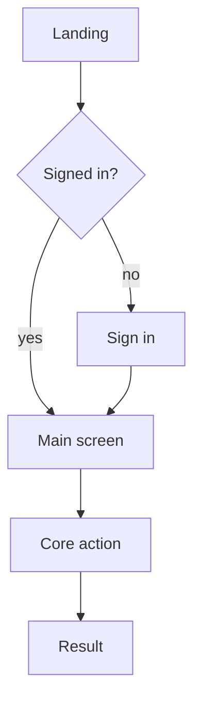

# App flow — <PROJECT NAME>

Every path a real user can walk through this app, start to finish. An agent reads
this to know what screen leads where, and what happens when things go wrong.

Fill every `<...>`. Delete sections that genuinely do not apply, rather than
leaving them empty.

> Draw it on paper first. A flow you have sketched takes ten minutes to write up.
> A flow you are inventing in prose takes an hour and comes out wrong.

## 1. Entry points

Everywhere a person can arrive from. Cold traffic and returning users take
different paths and both need to work.

| Entry | Lands on | State they arrive in |
|---|---|---|
| Direct URL / app icon | `<screen>` | `<logged out / logged in / first run>` |
| Shared link | `<screen>` | `<what the link carries: an id? a filter?>` |
| Notification tap | `<screen>` | `<deep link target>` |
| Search result | `<screen>` | `<indexed pages only>` |

## 2. The happy path

The one path that matters most. If this breaks, the app is down regardless of
what else works. Number every step.

1. `<user does X>` → `<system does Y>` → `<user now sees Z>`
2. ...
3. ...

**Done means:** `<the exact observable thing that says this path succeeded>`

Replace that skeleton with the real thing. Keep it under about fifteen nodes; a
diagram nobody can read is worse than a numbered list.

## 3. Every screen

One block per screen. This is the part an agent uses most.

### `<Screen name>`

- **Route:** `<path or activity>`
- **Who reaches it:** `<from which screens, in which state>`
- **They see:** `<the content, in priority order — what is above the fold?>`
- **They can:** `<action → where it leads>`
- **Empty:** `<what shows when there is no data yet>`
- **Loading:** `<skeleton, spinner, or nothing>`
- **Error:** `<the message, and the way out>`
- **Offline:** `<cached, degraded, or blocked>`

Repeat for each screen.

## 4. States that are not the happy path

These get skipped and then get discovered by users. Fill them in now.

- [ ] **First run, no data.** What does a brand-new user see before they have
      created anything? Name the screen and the one action it pushes.
- [ ] **Slow connection.** Ghana mobile data, 3G. What appears in the first
      second? What is still usable at 5s?
- [ ] **Request failed.** Network gone, server 500, third-party API down. What
      does the user see, and can they retry without losing input?
- [ ] **Permission refused.** Location, notifications, storage denied. The app
      still has to work, or explain why it cannot.
- [ ] **Back button / refresh mid-flow.** Does the user lose typed input?
- [ ] **Double submit.** Two taps on the same button. One record or two?
- [ ] **Session expired.** Where do they land, and do they get back to where
      they were?

## 5. Exits, on purpose or otherwise

| Exit | Trigger | What we keep |
|---|---|---|
| Completed the task | `<...>` | `<what persists>` |
| Abandoned mid-flow | `<...>` | `<draft saved? nothing?>` |
| Signed out | `<...>` | `<local data cleared?>` |
| Deleted account | `<...>` | `<what is removed, what is retained and why>` |

## 6. Flows explicitly not built

Mirrors NOT IN V1 in PROFILE.md. Listed here so no session helpfully builds one.

- `<flow>`, because `<reason>`
- `<flow>`, because `<reason>`

## Changing this file

If a build session finds the real flow differs from this document, the document
is wrong and gets updated in the same commit as the code. A flow doc that
describes last month's app is what sends an agent confidently in the wrong
direction.
